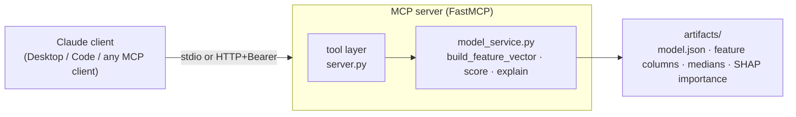

# Credit Risk MCP Server

An [MCP](https://modelcontextprotocol.io) (Model Context Protocol) server that
exposes a trained **Home Credit Default Risk** model as tools any Claude client
can call in plain conversation — score a borrower, explain the prediction with
SHAP, compare applicants, and query the model's metadata.

It wraps the XGBoost model from my
[home-credit-default](https://github.com/pranav797/home-credit-default) project
and serves it two ways: locally over stdio (for Claude Desktop / Claude Code) and
remotely over HTTP with API-key authentication (so any MCP client can reach it).

> ⚠️ **Educational project.** The model is trained on a public Kaggle dataset and
> is **not** a real lending-decision system. Do not use it to make credit
> decisions about real people.

## What it does

Describe a loan applicant in plain terms and Claude will call the right tool:

| Tool | What it returns |
|------|-----------------|
| `score_borrower` | Default probability (0–1), a risk tier, and a decision flag at the recall-oriented 0.15 threshold |
| `explain_prediction` | The top factors pushing risk up or down for one applicant, via SHAP, with human-readable names |
| `get_model_info` | Model type, AUC, precision/recall at different thresholds, and limitations |
| `get_feature_importance` | The model's globally most important features (mean \|SHAP\|) |
| `compare_borrowers` | Several applicants scored and ranked from most to least risky |

The interesting engineering problem: the model expects a **235-column encoded
vector**, but a person can only describe ~10 things about a borrower. The server
starts from training-set medians and overlays the fields the user actually
provides — replicating the notebook's exact encodings and engineered features — so
a handful of plain inputs become a valid model row. It also reports which fields
fell back to defaults, so the estimate's confidence stays transparent.

## Architecture



The model and its supporting data are exported once into small, portable JSON
artifacts (`artifacts/`), so the server has no dependency on the original 362 MB
training CSV at run time.

## Quickstart (local)

Requires [uv](https://docs.astral.sh/uv/).

```bash
uv sync
uv run --extra dev pytest -q        # 24 tests
uv run python -m credit_risk_mcp.server   # runs over stdio (waits for a client)
```

### Connect it to Claude Code

```bash
claude mcp add credit-risk -s user -- uv --directory /ABSOLUTE/PATH/TO/credit-risk-mcp run python -m credit_risk_mcp.server
```

Start a new session, then try: *"Score a borrower: 34, $54k income, wants a $450k
loan, working, external credit scores around 0.15."*

### Explore the tools

```bash
npx @modelcontextprotocol/inspector uv run python -m credit_risk_mcp.server
```

## Remote (HTTP + auth)

Over HTTP the server requires a bearer key on every request, so it's safe to
expose. Set the secret and run:

```bash
export CREDIT_RISK_API_KEY="$(uv run python -c 'import secrets; print(secrets.token_urlsafe(32))')"
uv run credit-risk-http
```

The MCP endpoint is served at `/mcp`; a public `/health` route is left open for
platform health checks. Requests without a valid `Authorization: Bearer <key>`
header get `401`. A `Dockerfile` and `render.yaml` are included for one-click
deployment to Render (or any Docker host); the platform injects `$PORT` and you
provide `CREDIT_RISK_API_KEY` as a secret.

Point a client at the deployed URL:

```bash
claude mcp add credit-risk-remote --transport http https://YOUR-APP.onrender.com/mcp --header "Authorization: Bearer YOUR_KEY"
```

## About the model

- **Model:** XGBoost classifier (100 trees, max depth 5), 235 features, trained on
  ~308k applications from the Kaggle [Home Credit Default Risk](https://www.kaggle.com/c/home-credit-default-risk)
  dataset (SMOTE-balanced for the ~92%/8% class imbalance).
- **Performance:** AUC-ROC ≈ 0.75.
- **Threshold:** predictions use a **0.15** decision threshold rather than 0.5.
  In credit risk a missed defaulter (lost principal) costs far more than a false
  alarm, so the model is tuned for recall (~0.47 recall / ~0.21 precision at 0.15).
- **What drives it:** external credit-bureau scores (`EXT_SOURCE_1/2/3`) dominate,
  followed by employment type and demographics.

## Tech stack

Python · [MCP Python SDK (FastMCP)](https://modelcontextprotocol.io) · XGBoost ·
SHAP · pandas · Pydantic · Starlette/Uvicorn (HTTP) · Docker · uv.
